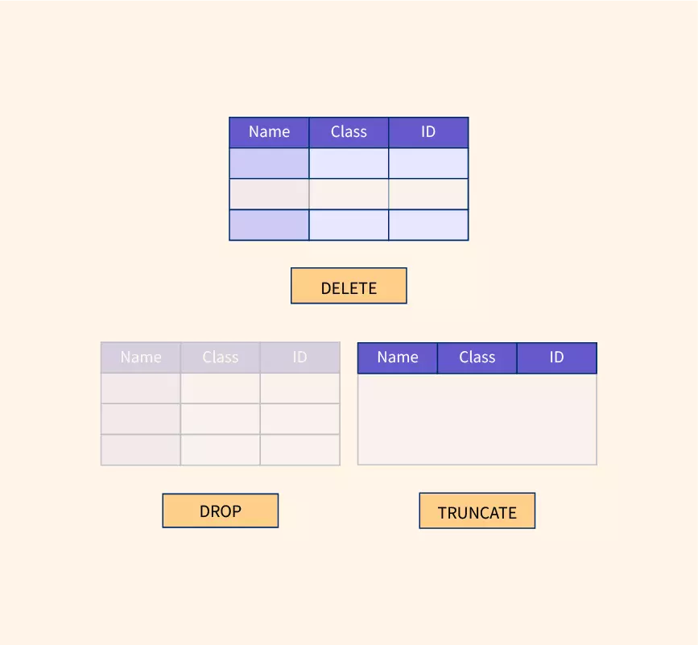
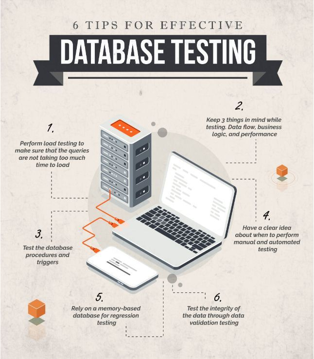
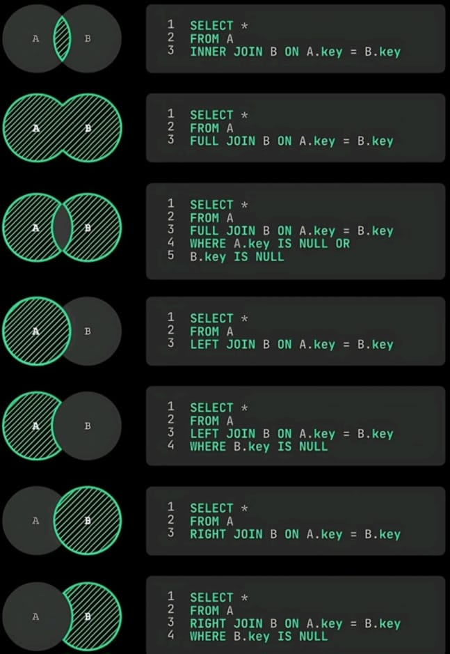

# SQA ইঞ্জিনিয়ারদের জন্য ডেটাবেস ইন্টারভিউ প্রশ্নোত্তর

## 1) কেন একজন এসকিউএ ইঞ্জিনিয়ারকে এসকিউএল জানা উচিত?
কারণ এপিআই/ইউআই সাফল্য অবিরাম ডেটা সঠিকতার গ্যারান্টি দেয় না।

## 2) ডেটা অখণ্ডতা এবং ডেটা সামঞ্জস্যের মধ্যে পার্থক্য কী?
সততা হল ডেটা নিয়মের মধ্যে সঠিকতা; ধারাবাহিকতা হল টেবিল/পরিষেবা এবং রাজ্য জুড়ে ডেটার চুক্তি।

## 3) মাল্টি-স্টেপ প্রবাহে আপনি কীভাবে রোলব্যাককে যাচাই করবেন?
N ধাপে ব্যর্থতা বলুন এবং যাচাই করুন যে কোনও সম্পর্কিত টেবিলে কোনও আংশিক লেখা নেই।

## 4) আপনি কিভাবে বুদ্ধিমত্তা পরীক্ষা করবেন?
একই আইডেমপোটেন্সি কী সহ একই অনুরোধ একাধিকবার পাঠান এবং যাচাই করুন শুধুমাত্র একটি ব্যবসার রেকর্ড বিদ্যমান।

## 5) আপনি কিভাবে ডুপ্লিকেট পেমেন্ট/অর্ডার সমস্যা সনাক্ত করবেন?
লেনদেন/রেফারেন্স কীগুলিতে দলবদ্ধ প্রশ্নগুলি ব্যবহার করুন এবং যাচাই করুন `COUNT(*)` অবশিষ্ট 1৷

## 6) সফ্ট ডিলিট কি এবং আপনি কিভাবে এটি যাচাই করবেন?
মুছে ফেলা পতাকা/টাইমস্ট্যাম্প সহ রেকর্ড অবশেষ; সুস্পষ্টভাবে অনুরোধ না করা পর্যন্ত তালিকা যাচাই/রিপোর্টের প্রশ্নগুলি মুছে ফেলা রেকর্ডগুলিকে বাদ দেয়।

## 7) DB পরীক্ষায় আপনি কোন প্রশ্নগুলি সবচেয়ে বেশি ব্যবহার করেন এবং আপনি কীভাবে দুটি টেবিল জুড়ে ডেটা যাচাই করবেন?
`SELECT`, `JOIN`, `GROUP BY`, `COUNT`, এবং `WHERE` এ লক্ষ্যযুক্ত ফিল্টার।
ক্রস-টেবিল চেকের জন্য, কী ক্ষেত্রগুলিতে `INNER JOIN`/`LEFT JOIN` ব্যবহার করুন (উদাহরণস্বরূপ, `orders.user_id = users.id`) এবং রেকর্ড গণনা/মানগুলি API আচরণের সাথে মেলে তা যাচাই করুন৷

## 8) আপনি কিভাবে মাইগ্রেশন মান যাচাই করবেন?
স্থাপনার আগে এবং পরে সারি গণনা, নমুনা রেকর্ড, সীমাবদ্ধতা, সূচী এবং ফলব্যাক সামঞ্জস্যতা পরীক্ষা করুন।

## 9) এতিম রেকর্ডের কারণ কী এবং আপনি কীভাবে তাদের ধরবেন?
ভাঙা মুছে ফেলা/আপডেট যুক্তি বা অনুপস্থিত FK প্রয়োগ; `LEFT JOIN ... WHERE parent IS NULL` প্রশ্নের সাথে সনাক্ত করুন।

## 10) আপনি কিভাবে SQL ইনজেকশন সুরক্ষা পরীক্ষা করবেন?
দূষিত ইনপুট পেলোডগুলি পাঠান এবং কোনও কোয়েরি ম্যানিপুলেশন, কোনও ডেটা এক্সপোজার এবং নিয়ন্ত্রিত বৈধতা ত্রুটিগুলি যাচাই করুন৷

## ১১) ডিবি ডিফেক্ট টিকিটে কী সংযুক্ত করতে হবে?
Repro পদক্ষেপ, API প্রমাণ, বৈধতা ক্যোয়ারী, ক্যোয়ারী আউটপুট, প্রভাবিত টেবিল/কলাম, এবং ব্যবসায়িক প্রভাব।

## 12) আপনি কীভাবে ডিবি ত্রুটিগুলিকে অগ্রাধিকার দেবেন?
ব্যবহারকারীর প্রভাব, পুনরুদ্ধারযোগ্যতা, আর্থিক ঝুঁকি এবং দুর্নীতি চলছে কিনা।

## 13) আপনি কোন ডাটাবেস(গুলি) ব্যবহার করেছেন এবং প্রশ্ন লেখার ক্ষেত্রে আপনি কতটা স্বাচ্ছন্দ্যবোধ করেন?
আমার কাছে এসকিউএল-এর মাধ্যমে অ্যাপ্লিকেশন ডেটা যাচাই করার অভিজ্ঞতা রয়েছে এবং আমি ব্যবহারিক QA প্রশ্নগুলি লিখতে এবং পর্যালোচনা করতে স্বাচ্ছন্দ্যবোধ করি (`JOIN`, সমষ্টি, ডুপ্লিকেট চেক, অনাথ চেক, এবং লেনদেনের বৈধতা)।

## 14) `DELETE`, `TRUNCATE` এবং `DROP` এর মধ্যে পার্থক্য কী?
`DELETE` নির্বাচিত সারিগুলিকে সরিয়ে দেয় (`WHERE` ব্যবহার করতে পারে), `TRUNCATE` টেবিলের কাঠামো রাখার সময় দ্রুত সমস্ত সারি সাফ করে, এবং `DROP` টেবিল অবজেক্ট নিজেই সরিয়ে দেয় (স্ট্রাকচার + ডেটা)।

ভিজ্যুয়াল রেফারেন্স:

অতিরিক্ত নোট:

## আমদানি করা সংযোজন (2026-05-02)

### সূত্র: imports/notion/all-pages/database-testing-5d86db1a.md

আপনি কোন ডিবি ব্যবহার করেছেন? প্রশ্ন লিখতে আপনি কতটা আরামদায়ক? আপনি যদি দুটি টেবিল জুড়ে ডেটা পরীক্ষা করতে চান তবে আপনি এটি কীভাবে করবেন?
