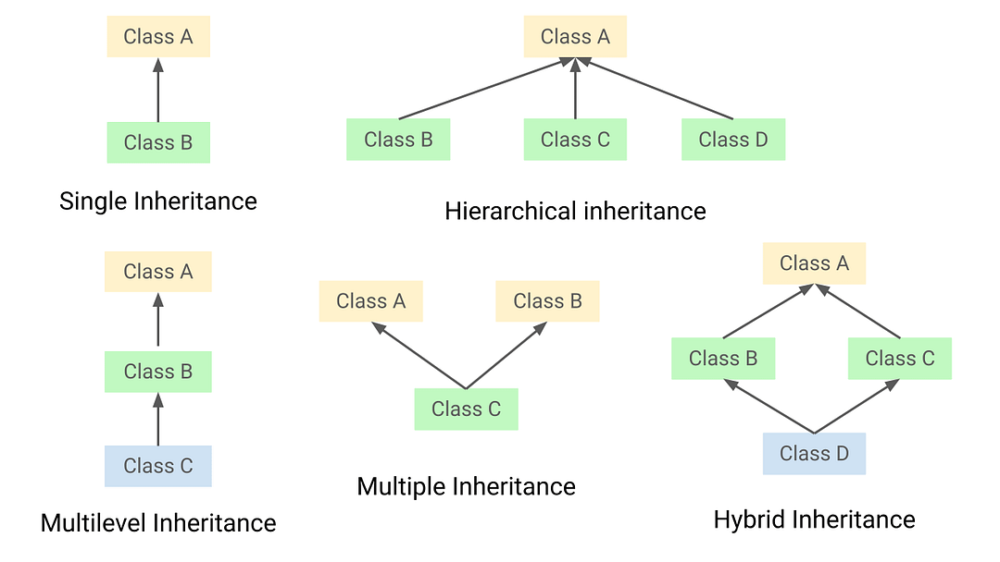
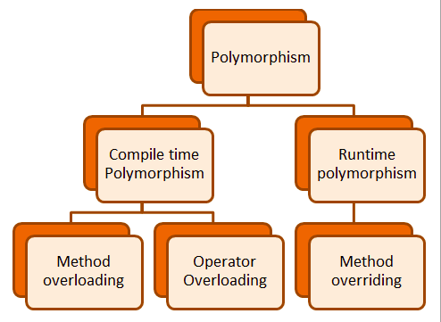
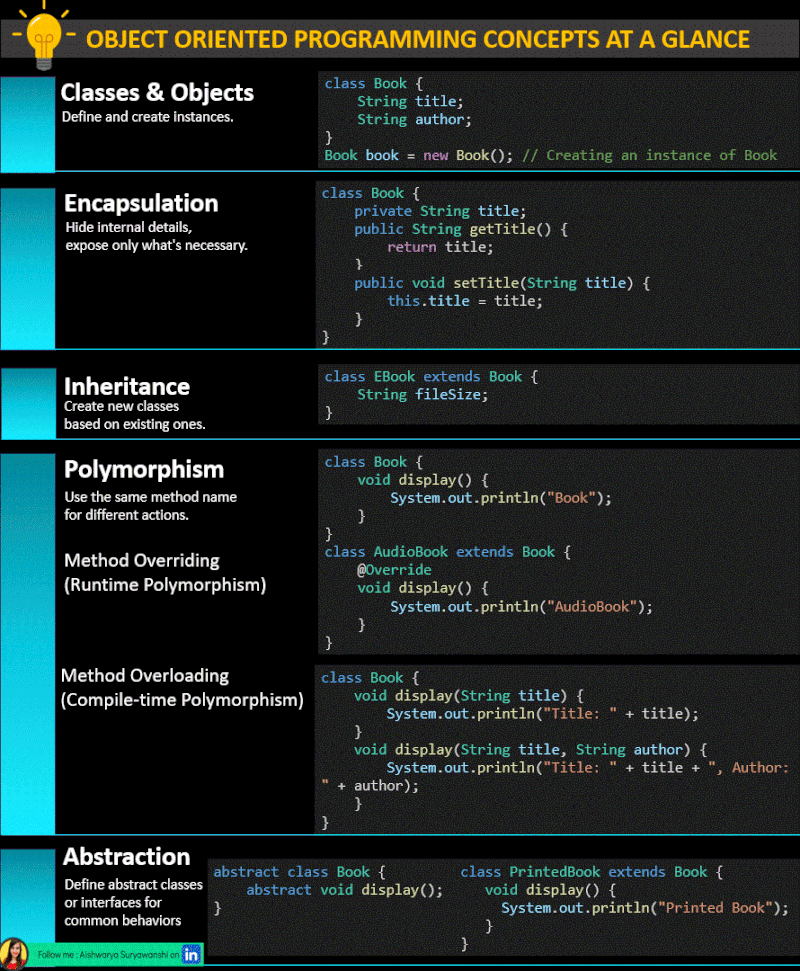
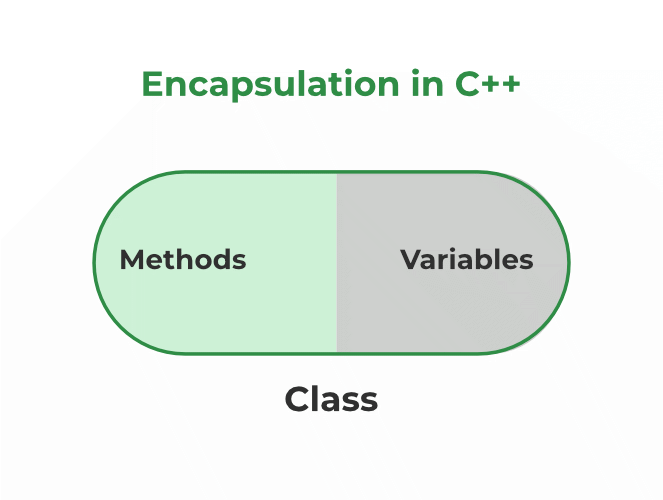

# Java OOP Fundamentals

## OOP in Java at a Glance

> **সহজভাবে / In simple words:** Object-oriented programming groups data and behavior into reusable objects.
>
> **কেন গুরুত্বপূর্ণ / Why it matters:** These ideas help organize automation code into understandable and maintainable parts.

### ⭐ **Classes & Objects:**

Classes are blueprints that define the properties and behaviors of objects. An object is an instance of a class, representing a specific realization of the blueprint with its own unique state and behavior. This allows for creating and managing multiple instances with similar structures but different data.

### ⭐ Encapsulation:

Encapsulation involves bundling the data (attributes) and the methods that operate on the data into a single unit (a class). It restricts direct access to some of the object's components, which can prevent unintended interference and misuse of the data. By providing access methods (getters and setters), encapsulation ensures that data is accessed and modified in a controlled manner.

### ⭐ Inheritance:

Inheritance allows a new class to inherit properties and behaviors from an existing class. This promotes code reuse by enabling the creation of a new class based on an existing class, called the parent or superclass. The new class, known as the child or subclass, can extend or modify the inherited features and add new ones. This hierarchical relationship helps in organizing code and building upon existing functionality.

[Java Bangla Tutorials 127 : Inheritance (Theory) (youtube.com)](https://www.youtube.com/watch?v=4HbOzg4aWFk&list=PLeZMjV76KKKVxUvqqofY9VQZYBP5MPKW4)

[Java Bangla Tutorials 128 : Inheritance (practical) (youtube.com)](https://www.youtube.com/watch?v=XZO7OMMFMl8&list=PLeZMjV76KKKVxUvqqofY9VQZYBP5MPKW4&index=2)

[Java Bangla Tutorials 129 : Inheriting Private Member | setters, getters (youtube.com)](https://www.youtube.com/watch?v=tF0JZVWr3IQ&list=PLeZMjV76KKKVxUvqqofY9VQZYBP5MPKW4&index=3)

### ⭐ Polymorphism:

Polymorphism allows objects to be treated as instances of their parent class rather than their actual class. It provides the ability to use a single method name to perform different tasks based on the object’s actual class. This is achieved through:

**Method Overloading**: Defining multiple methods with the same name but different parameter lists within the same class. This enables the use of the same method name to perform various functions based on the arguments passed.

**Method Overriding**: Redefining a method in a subclass that has already been defined in its superclass. This allows a subclass to provide a specific implementation of a method that is already defined in its superclass, enhancing the method’s functionality for the subclass.

[Java Bangla Tutorials 144 : Polymorphism (Theory) (youtube.com)](https://www.youtube.com/watch?v=AlTTlEj2Z78)

### ⭐ Abstraction:

Abstraction involves defining abstract classes or interfaces that provide a common interface for a group of related classes. It focuses on exposing only the relevant features of an object while hiding the complex implementation details. This helps in designing systems where the internal workings are hidden, and only the essential aspects are exposed to the user, facilitating easier management and scalability.

### 🚀 Benefits of OOP:

- Reusability: Leverage existing classes to build new functionalities, reducing redundancy and saving time.
- Maintainability: Simplify updates and fixes by managing code in modular units (classes).
- Flexibility: Adapt and extend code with minimal disruption through inheritance and polymorphism.

অবজেক্ট ওরিয়েন্টেড প্রোগ্রামিং (OOP) হলো একটি প্রোগ্রামিং প্যারাডাইম যা ডেটা এবং তার উপরে পরিচালিত কার্যকলাপকে (ফাংশন বা মেথড) একত্রে একটি অবজেক্ট হিসেবে গঠন করে। OOP মূলত চারটি প্রধান নীতির ওপর ভিত্তি করে গড়ে ওঠে:

1.Encapsulation (এনক্যাপসুলেশন):

এনক্যাপসুলেশন মানে ডেটা এবং ফাংশনগুলোকে একসাথে একটি ইউনিটে (অবজেক্টে) গঠন করা। এতে ডেটা বাইরের প্রোগ্রামের অংশ থেকে সরাসরি অ্যাক্সেস করা যায় না, বরং একটি পাবলিক ইন্টারফেসের মাধ্যমে অ্যাক্সেস করতে হয়। এটি ডেটার নিরাপত্তা বৃদ্ধি করে এবং কোডের জটিলতা কমায়।

2.Inheritance (ইনহেরিটেন্স):

ইনহেরিটেন্সের মাধ্যমে একটি নতুন ক্লাস তৈরি করা যায় যা পূর্বে বিদ্যমান ক্লাসের সব বৈশিষ্ট্য (প্রোপার্টি) এবং আচরণ (মেথড) উত্তরাধিকারসূত্রে পায়। এটি কোড পুনর্ব্যবহারের সুবিধা দেয় এবং প্রোগ্রামিংকে আরও কার্যকর করে তোলে।

3.Polymorphism (পলিমরফিজম):

পলিমরফিজমের মাধ্যমে একটি মেথড বা অপারেশনকে একাধিক রূপে ব্যবহার করা যায়। উদাহরণস্বরূপ, একটি মেথড বিভিন্ন ধরনের ডেটার জন্য ভিন্ন ভিন্নভাবে আচরণ করতে পারে। এটি কোডের নমনীয়তা বৃদ্ধি করে।

4.Abstraction (অ্যাবস্ট্রাকশন):

অ্যাবস্ট্রাকশন হলো ডেটার অপ্রয়োজনীয় জটিলতা দূর করে শুধুমাত্র প্রয়োজনীয় বিষয়গুলোকে সামনে আনা। এটি ব্যবহারকারীর দৃষ্টিকোণ থেকে সিস্টেমকে সহজ ও বোধগম্য করে।

💡কেন OOP গুরুত্বপূর্ণ:

1.কোড পুনর্ব্যবহারযোগ্যতা (Reusability):

ইনহেরিটেন্সের মাধ্যমে কোড পুনর্ব্যবহারের সুযোগ দেয়, যা কোডের পরিমাণ কমিয়ে দেয় এবং ডেভেলপমেন্ট সময় কমায়।

2.ডেটা নিরাপত্তা (Data Security):

এনক্যাপসুলেশন ডেটাকে বাইরের অ্যাক্সেস থেকে রক্ষা করে এবং ডেটার অখণ্ডতা নিশ্চিত করে।

3.সহজ রক্ষণাবেক্ষণ (Easy Maintenance):

কোডের জটিলতা কম থাকায় OOP ব্যবহার করে তৈরি সফটওয়্যার সহজে রক্ষণাবেক্ষণ করা যায়।

4.বিশেষায়িত সমস্যার সমাধান (Specialized Problem Solving):

পলিমরফিজম এবং অ্যাবস্ট্রাকশন ব্যবহার করে বিশেষ সমস্যার সমাধান সহজে করা যায়।

💡কিভাবে OOP ব্যবহার করবেন:

1.ক্লাস এবং অবজেক্ট তৈরি:

প্রথমে একটি ক্লাস তৈরি করতে হবে, যা মূলত একটি ব্লুপ্রিন্ট হিসেবে কাজ করে। এরপর সেই ক্লাস থেকে অবজেক্ট তৈরি করা হয়।

2.মেথড এবং প্রোপার্টি সংজ্ঞায়িত করা:

প্রতিটি ক্লাসে মেথড এবং প্রোপার্টি সংজ্ঞায়িত করতে হবে, যা ঐ ক্লাসের অবজেক্টের মাধ্যমে অ্যাক্সেস করা যাবে।

3.ইনহেরিটেন্স প্রয়োগ করা:

নতুন ক্লাস তৈরি করতে হলে পূর্বে বিদ্যমান ক্লাস থেকে ইনহেরিট করা যায়।

4.পলিমরফিজম এবং অ্যাবস্ট্রাকশন ব্যবহার:

মেথড ওভাররাইডিং এবং ইন্টারফেসের মাধ্যমে পলিমরফিজম এবং অ্যাবস্ট্রাকশন প্রয়োগ করা যায়।

OOP-এর মাধ্যমে প্রোগ্রামিংকে আরও সংগঠিত, নিরাপদ, এবং সহজতর করা সম্ভব, যা বড় প্রজেক্টে খুবই গুরুত্বপূর্ণ।

[জাভা Object-Oriented Programming (OOP) Principles](https://www.linkedin.com/pulse/জভ-object-oriented-programming-oop-principles-hiro-mia-xefyf/?trackingId=SJsIW2xIRdaHUjTDAaf8ZA==)
