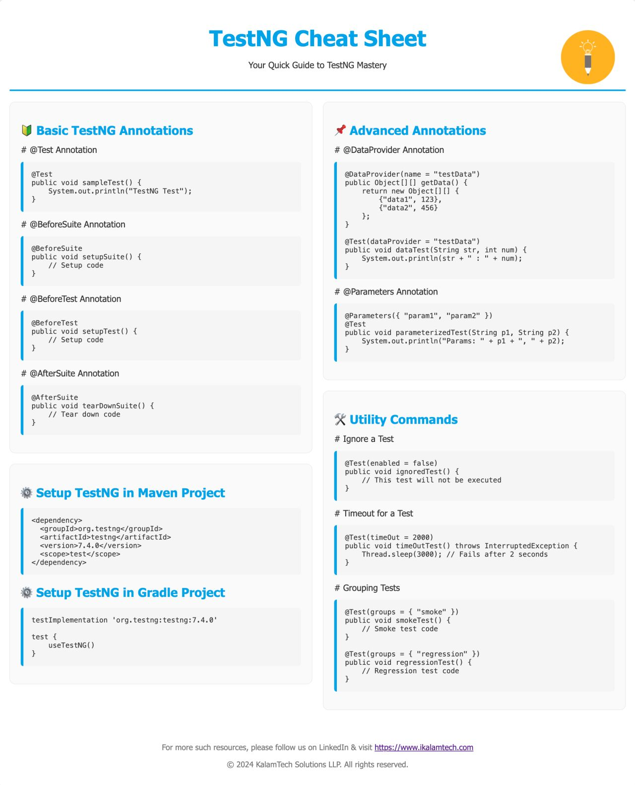

# TestNG Annotations, Data, and Configuration

## 1. **`@Test`**

- **Purpose**: This annotation marks a method as a test method. It can include additional attributes such as `priority`, `dependsOnMethods`, `enabled`, `invocationCount`, etc.
- **Example**:
    
    ```java
    @Test(priority = 1)
    public void testLogin() {
        System.out.println("This is the login test");
    }
    
    ```
    
- **Common Attributes**:
    - `priority`: Defines the order in which tests are executed. Lower values are executed first.
    - `enabled`: If set to `false`, the test will be ignored.
    - `dependsOnMethods`: Specifies that the test method should run only if the specified methods pass.
    - `invocationCount`: Runs the test method a specified number of times.

## 2. **`@BeforeSuite`**

- **Purpose**: The method annotated with `@BeforeSuite` runs once before all the test methods in the suite are executed.

## 3. **`@AfterSuite`**

- **Purpose**: This annotation is used to define a method that runs once after all the tests in the suite have been executed.

## 4. **`@BeforeTest`**

- **Purpose**: This annotation marks a method that runs before any test method in a `<test>` tag in the `testng.xml` file.

## 5. **`@AfterTest`**

- **Purpose**: This annotation marks a method that runs after all the test methods in a `<test>` tag in the `testng.xml` file.

## 6. **`@BeforeClass`**

- **Purpose**: The method annotated with `@BeforeClass` runs before the first test method in the current class.

## 7. **`@AfterClass`**

- **Purpose**: This annotation is used to define a method that runs after all the test methods in the current class.

## 8. **`@BeforeMethod`**

- **Purpose**: The method annotated with `@BeforeMethod` runs before each test method.

## 9. **`@AfterMethod`**

- **Purpose**: This annotation marks a method that runs after each test method.

## 10. **`@BeforeGroups`**

- **Purpose**: This annotation is used to run a method before the first test method in a specified group.

## 11. **`@AfterGroups`**

- **Purpose**: The method annotated with `@AfterGroups` runs after the last test method in the specified group.

## 12. **`@DataProvider`**

- **Purpose**: This annotation allows you to provide data to a test method. It returns an `Object[][]`, and the test method will run multiple times based on the data returned by the data provider.
- **Example**:
    
    ```java
    @DataProvider(name = "loginData")
    public Object[][] dataProvider() {
        return new Object[][] {
            {"user1", "pass1"},
            {"user2", "pass2"}
        };
    }
    
    @Test(dataProvider = "loginData")
    public void testLogin(String username, String password) {
        System.out.println("Login test with: " + username + " " + password);
    }
    
    ```
    

## 13. **`@Factory`**

- **Purpose**: The `@Factory` annotation allows you to run a set of test methods using different data or configurations.
- **Example**:
    
    ```java
    @Factory
    public Object[] createInstances() {
        return new Object[] {new TestClass("data1"), new TestClass("data2")};
    }
    
    ```
    

## 14. **`@Listeners`**

- **Purpose**: This annotation is used to define TestNG listeners that monitor the status of the test execution. You can implement custom listeners for logging, report generation, etc.
- **Example**:
    
    ```java
    @Listeners(CustomListener.class)
    public class TestClass {
        @Test
        public void testMethod() {
            System.out.println("Test method with listener");
        }
    }
    
    ```
    

## 15. **`@Parameters`**

- **Purpose**: This annotation allows you to pass parameters from the `testng.xml` file to test methods.
- **Example**:
    
    ```java
    @Parameters({"username", "password"})
    @Test
    public void testLogin(String username, String password) {
        System.out.println("Login with: " + username + " and " + password);
    }
    
    ```
    

## 



1. **How to maximize the screen in Selenium?**

In Selenium WebDriver, you can maximize the browser window using the `manage().window().maximize()` method. This method is useful to ensure that the browser window is fully expanded before running the tests, allowing for consistency across different browser environments.

Here’s how you can maximize the browser window in Selenium:

## Code Example:

```java
import org.openqa.selenium.WebDriver;
import org.openqa.selenium.chrome.ChromeDriver;

public class MaximizeWindowExample {
    public static void main(String[] args) {
        // Set the path for the WebDriver executable
        System.setProperty("webdriver.chrome.driver", "/path/to/chromedriver");

        // Initialize a ChromeDriver instance
        WebDriver driver = new ChromeDriver();

        // Maximize the browser window
        driver.manage().window().maximize();

        // Open a URL
        driver.get("<https://www.example.com>");

        // Perform actions or assertions

        // Close the browser
        driver.quit();
    }
}

```

## Key Points:

- The `manage().window().maximize()` method works across most browsers (e.g., Chrome, Firefox, Edge, etc.).
- It's recommended to maximize the window early, right after initializing the WebDriver, before interacting with any web elements.
## Notion source

- [Original detailed Notion page](https://app.notion.com/p/115995ff8e4680c4a39cef044d0cc92f)

Last synchronized: 2026-09-19.
